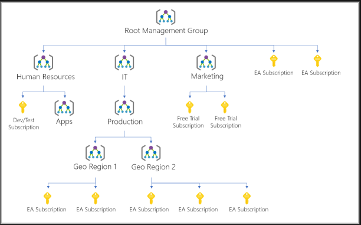

## Azure Infrastructure

The core architectural components of Azure may be broken down into two main groupings
1. Physical Infrastructure
2. Management Infrastructure

--

### Physical Infrastructure
Physical infrastructure for azure starts with datacenters. 
Conceptually, the datacenters are the same as large corporate datacenters

Datacenters are grouped into Azure Regions or Azure Availability Zones that are designed to help you achieve resiliency and reliability for your business-critical workloads

#### Regions

A region is a geographical area on the planet that contains at least one, but potentially multiple datacenters that are nearby and networked together with a low-latency network.

When you deploy a resource in Azure, you will often need to choose the region where you want your resource deployed.

#### Availability Zones
These are physically separate datacenters within an Azure region. Each availability zone is made up of one or more datacenters equipped with independent and necessary physical measures to keep the datacenter in working condition most of the times.

a zone is set up to be an isolation boundary. If one zone goes down, the other continues working. Availability zones are connected through high-speed, private fiber-optic networks

Availability zones are primarily for VMx, managed disks, load balancers, SQL databases

#### Region pairs
Most azure regions are paried with another region within the same geography at-least 1300 miles away.
This approach allows for the replication of resources across a geography that helps reduce the likelihood of interruptions because of events such as natural disasters, civil unrest, power outrages, or physical network outages that affect an entire region.

> Not all Azure services automatically replicate data or automatically fall back from a failed region to cross-replicate to another enabled region. In these scenarios, recovery and replication must be configured by the customer

Most regions are paried in two directions, which means that primary regions provides backup for its secondary regions

But some regions are one-direction paired, which means that primary region does not provide backup for its secondary region.

#### Sovereign Regions
These are instances of Azure that are isolated from the main instance of Azure.

----

### Management Infrastructure
includes Azure resources and resource groups, subscriptions, and accounts

#### Azure resources and Resource Groups

A resource is hte basic building block of Azure. Anything you create, provision, deploy etc. is a resource.
Virtual Machines, virtual networks, databases, cognitive services etc, are all considered resources within Azure

Resource Groups are groupings of resources.
When you create a resource, you are required to place it into a resource group

A single resource group can contain multiple resources, a single resource can only be in one resource group at a time.
When you move a resource to a new group, it will no longer be associated with the former group. Additionally, resource groups cant be nested, meaning you cant put resource group B inside of resource group A

Actions performed on the groups will apply to all the resources present in that resource group.

#### Azure subscriptions
IN Azure, subscriptions are a unit of management, billing and scale.

Using Azure requires an Azure subscription, this provides you with authenticated and authorized access to Azure products and services, also allows you to provision resources.

There are two types of subscription boundaries that you can use:
1. Billing boundary
    determines how an azure account is billed fro using azure
2. Access Control Boundary
    azure applies access-management policies at the subscription level, and you can create separate subscriptions to reflect different organizational structures.
    This billing model allows you to manage and control access to the resources that users provision with specific subscriptions

#### Azure Management groups
Resources are gathered into resource groups, and resource groups are gathered into subscriptions.

If you have many subscriptions, you might need a way to efficiently manage access, policies and compliance for those subscriptions.
Azure management groups provide a level of scope above subscriptions. You can organize subscriptions into containers called management groups and apply governance conditions to the mangement groups, the same way that resource groups inherit settings from a subscriptions and resources inherit from resource groups.
Management groups give you enterprise-grade management at a large scale, no matter what type of subscriptions you might have.

-> 10k management groups can be supported in a single directory
-> a management group tree can support up to six levels of depth. This limit doesnt include the root level or the subscription level.
-> Each management group and subscription can support only one parent.