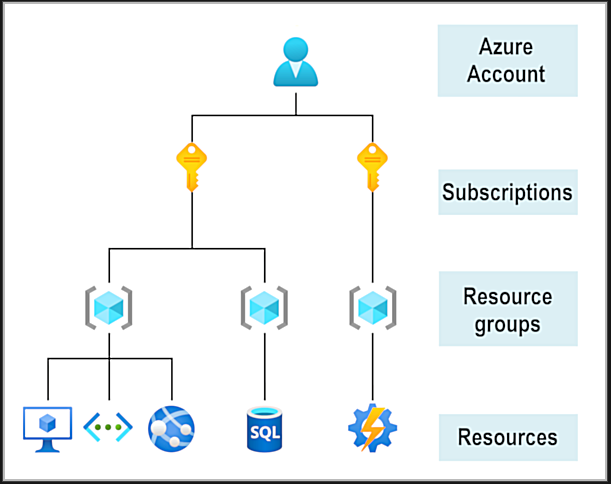

Physical organization of Azure: datacenters, availability zones, regions

Organizational Structure of Azure: resources and resource groups, subscriptions, and management groups

---

## Core Architectural components of Azure

1. Azure regions, region pairs, sovereign regions
2. Availability zones
3. Azure datacenters
4. Azure resources and Resource groups
5. Subscriptions
6. Management Groups
7. Hierarchy of resource groups, subscriptions and management groups

--

### What is Microsoft Azure
Azure provides more than 100 services that enable you to do everything from running your existing applications on virtual machines to exploring new software paradigms, such as intelligent bots and mixed reality.

--

### Azure Account architecture

Microsoft Learn Sandbox
    snadbox to practice and learn azure services.

Once you get access to sandbox, you will have powershell to run your commands and test the resources and services.

Most Azure specific commands will start with the letters _az_
Example: _az version_ => azure specific command
        _Get-date_ => General powershell command to get the current date of the system

You can change your shell to _BASH_ by running the command **bash** in the terminal
In the case of bash shell though, you cant run commands like _Get-date_ coz these are related to windows OS and bash is related to UNIX OS which have different commands to perform the same action

But azure commands stays same in both the shells, bash shell and powershell

You can enter interactive mode using the command _az interactive_ and wait for some time.

[Azure Infrastructure](./Azure-architecture-and-services.md#Azure-infrastructure)

==> Exercise - create an azure resource, not done..

## Azure compute and Network Services

## Azure Storage Services

## Azure [Identity, Access, Security]